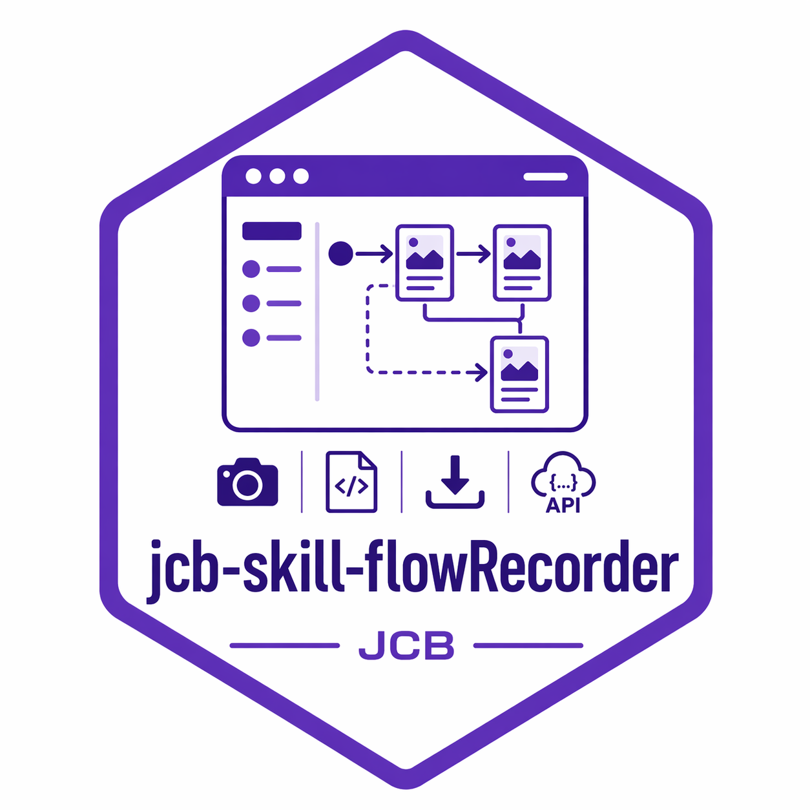

# jcb-skill-flowRecorder

一个面向 Codex 的半自动网站流程录制 skill。

English version: [README.md](./README.md)

作者：Chengbin Jia

`jcb-skill-flowRecorder` 用来在可见浏览器中记录网站的真实菜单跳转路径。你手动点击页面，它负责保存渲染后的页面、截图、资源文件以及 `fetch` / `xhr` 调用，便于后续整理站点结构、页面流程图和后端接口清单。

它不是简单的站点地图工具，而是面向“页面流程取证”和“接口观察”场景的采集器。它可以帮助你：

- 记录菜单到页面的跳转路径
- 保存整页截图
- 保存客户端加载完成后的 HTML
- 下载页面呈现所需资源
- 观察 `fetch` / `xhr` 接口调用
- 基于采集结果整理流程图和接口清单

它特别适合以下场景：

- 官网 / 营销站
- 文档站
- 登录后控制台
- 根据真实点击路径还原页面流程
- 反向梳理前端菜单与后端服务的关系

## 快速开始

在已安装的 skill 目录内，或在复制出的本地目录中，直接运行：

```bash
node scripts/record-menu-flow.mjs https://example.com
```

典型流程：

1. 打开目标站点。
2. 如有需要，手动完成登录。
3. 回到终端，按回车开始记录。
4. 在浏览器中手动点击菜单和链接。
5. 在终端按 `Ctrl+C` 停止并保存结果。

## Skill 内容

```text
jcb-skill-flowRecorder/
  SKILL.md
  README.md
  README.zh-CN.md
  agents/openai.yaml
  scripts/record-menu-flow.mjs
  references/output-format.md
```

## 目录内文件说明

- `SKILL.md`：Codex skill 入口说明
- `agents/openai.yaml`：展示名和简要描述等元数据
- `scripts/record-menu-flow.mjs`：实际执行录制的脚本
- `references/output-format.md`：输出文件格式与解释说明
- `README.md` / `README.zh-CN.md`：对外发布文档

## 依赖要求

- Node.js
- `playwright`
- Playwright 浏览器运行时，通常是 Chromium

如未安装，可执行：

```bash
npm install -D playwright
npx playwright install chromium
```

## 安装方式

这个目录本身就可以作为一个单独发布的 skill 目录。

推荐安装后的本地结构如下：

```text
~/.codex/skills/jcb-skill-flowRecorder/
  SKILL.md
  README.md
  README.zh-CN.md
  agents/
  scripts/
  references/
```

如果你把它作为仓库或压缩包分发，建议保持当前目录结构不变，这样 `SKILL.md` 中的相对路径引用不会失效。

## 运行方式

在 skill 目录内执行：

```bash
node scripts/record-menu-flow.mjs https://example.com
```

指定输出目录：

```bash
node scripts/record-menu-flow.mjs https://example.com --output docs/menu-flow
```

如需保留完整请求头、请求体和响应样本，不做脱敏：

```bash
node scripts/record-menu-flow.mjs https://example.com --include-sensitive
```

脚本默认以可见浏览器运行，默认输出目录为 `tools/menu-flow-output`。如需落到其他位置，可通过 `--output` 指定。

## 典型使用流程

1. 用目标 URL 启动脚本。
2. 脚本打开一个可见浏览器。
3. 如果目标站点需要登录，你手动完成登录。
4. 回到终端，按回车开始记录。
5. 在浏览器里手动点击菜单。
6. 在终端按 `Ctrl+C` 结束记录。
7. 查看输出结果。

## 输出目录结构

示例：

```text
docs/menu-flow/
  navigation-log.json
  navigation-map.csv
  navigation-flow.md
  captures/
    <capture_id>/
      screenshot.png
      page.html
      network.json
      api-calls.json
      resources/
```

字段级格式说明见 [references/output-format.md](./references/output-format.md)。

## 建议对外定位

这个 skill 最适合被定位为：

- 半自动网站菜单流录制器
- 页面流程与接口观察工具
- 默认带脱敏能力的本地采集工具
- 面向页面盘点、接口盘点和信息架构整理的辅助工具

## 推荐分析方式

分析采集结果时，建议按下面顺序处理：

1. 先读取 `navigation-log.json`
2. 用 `(source_url, clicked_text, target_url)` 去重导航边
3. 重绘一份更适合阅读的 Mermaid 流程图
4. 把业务接口和埋点 / 遥测接口分开
5. 按服务前缀归类后端接口，例如：
   - `iam-server`
   - `walletd-server`
   - `biz-server`
   - `api-server`
   - `panel-server`
   - `account-server`

## 隐私与安全

- 默认模式更安全，因为常见敏感字段会被脱敏。
- `--include-sensitive` 只应在可信的本地环境中使用。
- 不要公开发布包含 token、cookie、手机号、邮箱或私有业务数据的原始采集结果。
- 仅在你有权限访问和记录的网站与账号上使用本 skill。

## 当前限制

- 更适合半自动记录，不适合完全自主的大规模抓取。
- 某些 SPA 场景下，如果没有明确的点击到路由变化，记录可能不够完美。
- 某些响应并不是常规业务 JSON，而可能是 `_rsc` 之类的前端传输协议。
- 输出只覆盖本次会话里“实际访问过”的页面和接口，不代表全站完整地图。

## 发布说明

版本变更见 [CHANGELOG.md](./CHANGELOG.md)。

## 许可证

采用 [MIT License](./LICENSE)。
